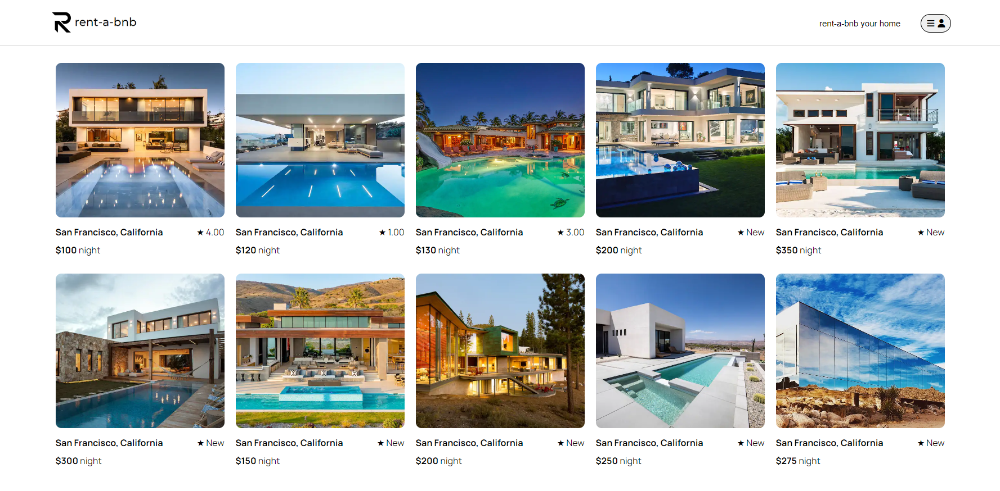

# **rent-a-bnb**
rent-a-bnb is a website clone that is inspired by <a href='https://www.airbnb.com/'>Airbnb</a>. rent-a-bnb is for people looking for a place to stay when going on vacations. It also allows people who have extra space or properties to host stays for people. Visit rent-a-bnb by clicking <a href='https://rent-a-bnb.onrender.com/'>here</a> or visiting this link: https://rent-a-bnb.onrender.com/.

## Wiki Links
- Api Routes: https://github.com/JvredH/Rent-A-BnB/wiki/API-ROUTES
- Database Schema: https://github.com/JvredH/Rent-A-BnB/wiki/Database-Schema
- Feature List: https://github.com/JvredH/Rent-A-BnB/wiki/Features-List
- Redux State Structure: https://github.com/JvredH/Rent-A-BnB/wiki/Redux-State-Structure

## Built With


	


## Features Directions

### Home page
You will be able to test the features without signing up by clicking on the demo user which can be found by clicking the icon on the top right of the page. When clicked the icon will display a login and sign up button. The login button contains the demo user option.



### Create a Spot
After signing in you will be able to create your own spot by clicking on "rent-a-bnb your home" on the top right of the page and you will be directed to this form.


### Spot Details
After creating a spot you can view the details of the spot you've just created. This is also where you can make edits to the spot in case you have errors and delete the spot as well if you wish. You can do these by clicking the buttons above the image to the right.


### Reviews
Reviews can be left and deleted at any spot detail page. All these functionalities will be found at the bottom of a spot detail page, example shown below.


## To Do List for Future Features
- [ ] add functionality to edit a review
- [ ] add ability to add photos of reviews
- [ ] full CRUD functionality to book sites
- [ ] user profile page

## To Get Started Locally
1. Clone the repo
2. Install dependencies by running ```npm install``` in root directory of project.
3. Open two terminals, cd into frontend folder in one terminal, in the other cd into backend
4. In back end terminal migrate tables and seed data by running:
  	- ```npx dotenv sequelize-cli db:migrate```
  	- ```npx dotenv sequelize-cli db:seed:all```
5. ```npm start``` in both terminals
6. Go to localhost:3000 in your browser and begin

## Contact Information
Jared Hem - hem.jared@gmail.com

Project Link: https://github.com/JvredH/Rent-A-BnB
